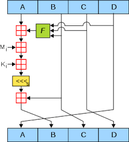

# **MD5**

#### MD5 is a hashing algorithm that converts a string of any length into a 128 bit hashed string

    Here is an example: Hello World! --> 7012acbb1d394b20567dffbf0992b677

Despite anything a certain member of our group might say, writing a hashing algorithm in (even if it's in C) is a very difficult task.

#### Here are the basic steps in the MD5 hashing algorithm
   
    1. Create helper functions:
    char * encode(char *plaintext);
    char *int2rebin(int binaryLength);
    int fromBinaryStringtoHex(const char *s);
    char * stringToBinaryString(char *plaintext);
    char * binaryStringToPaddedBinaryString(int binaryLength, char *binaryString);
    
    2. The first step is to pad the input string to the right length. 
    Regarless of the length (l) of the input string, each string must be padded with at least 63 zeros and one 1 until s. 
    This means that 64 numbers must be added to the end of the string. 
    Additionally, each string must be 512, so we pad the original string until (length % 512) = (448 % 512)

    3. We establish the preset A, B, C, and D that we are using for the upcoming cycle. These presets are (in hex):
    #define A 0x01234567
    #define B 0x89abcdef
    #define C 0xfedcba98
    #define D 0x76543210

    4. Now we establish the preset functions for the upcoming cycle, F, G, H, and I:
    #define F() ((B & D) | (~B & D))
    #define G() ((B & D) | (C & ~D))
    #define H() (B ^ C ^ D)
    #define I() (C ^ (B | ~D))

    5. We define the preset bit rotations:
    int SHIFT1[16] = {7, 12, 17, 22, 7, 12, 17, 22, 7, 12, 17, 22, 7, 12, 17, 22};
    int SHIFT2[16] = {5, 9, 14, 20, 5, 9, 14, 20, 5, 9, 14, 20, 5, 9, 14, 20};
    int SHIFT3[16] = {4, 11, 16, 13, 4, 11, 16, 13, 4, 11, 16, 13, 4, 11, 16, 13};
    int SHIFT4[16] = {6, 10, 15, 21, 6, 10, 15, 21, 6, 10, 15, 21, 6, 10, 15, 21}; 

    6. Create a changer variable K using the equation:
    #define K(i) (abs(sin(i + 1)) * MODADD

    * MODADD is a constant 2^32

    7. The last step before the main cycle is ro devide the 512 bit string into 16 32-bit blocks.

    8. We start the main driver loop. It can be summed up by the convoluted image you see below this list:
   

    9. After the main driver loop, we output the resultant hash.

## Any Questions?
